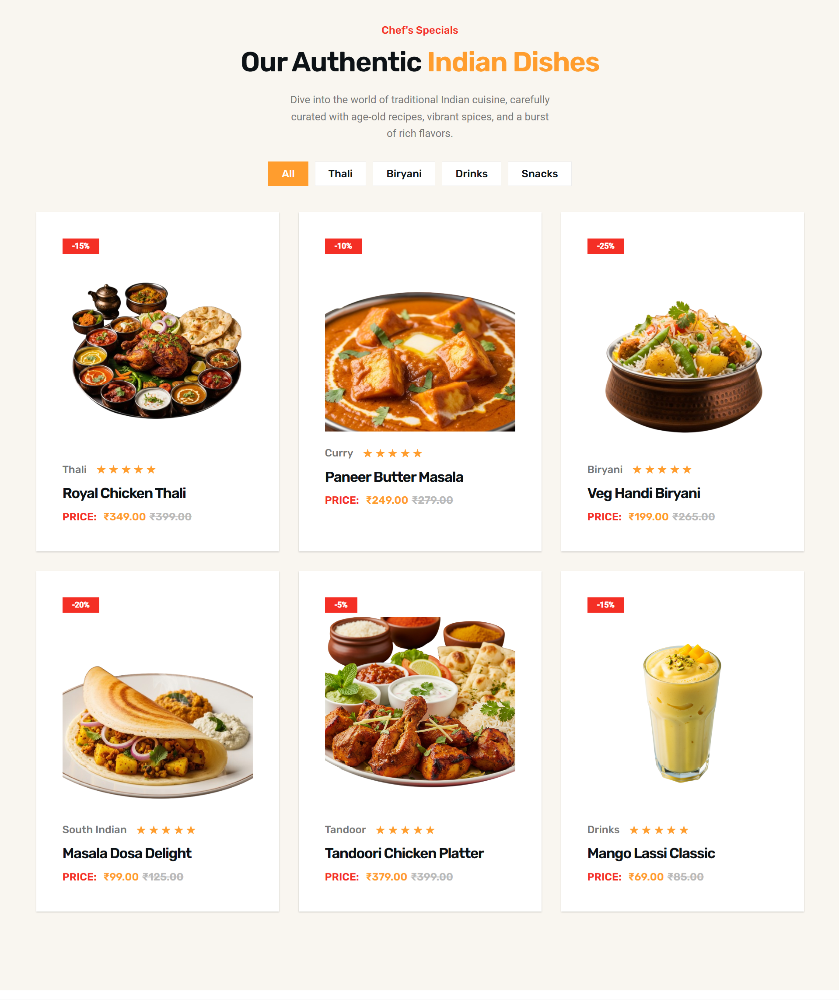
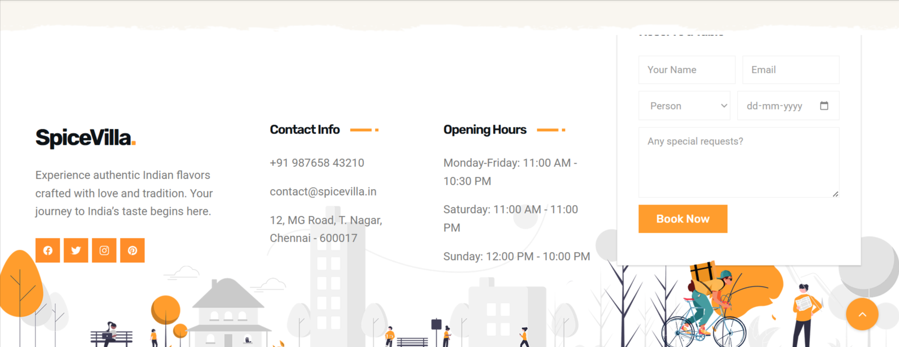

# 🌶️ SpiceHub – Responsive Restaurant Website

**SpiceHub** is a fully responsive restaurant website built using **HTML**, **CSS**, and **JavaScript**. It is designed to provide a clean, modern, and user-friendly interface suitable for restaurants, cafés, and food businesses.

## 🔗 Live Demo

Click here to view the live website:  
👉 [https://sharvika-s.github.io/SpiceHub/](https://sharvika-s.github.io/SpiceHub/)

---

## 🔗 Pages Included

### 🏠 Home Page
A welcoming landing page with a hero section and highlights.

---

### 👨‍🍳 About Us
Information about the restaurant's background.

---

### 🍽️ Menu
A stylish presentation of dishes offered, categorized for user ease.

---

### 📝 Blog
A section for articles, recipes, and food-related content.

---

### 📞 Contact Us
Contact form and address/location details for customer interaction.

---

## 🛠️ Built With

- HTML
- CSS
- JavaScript

---

